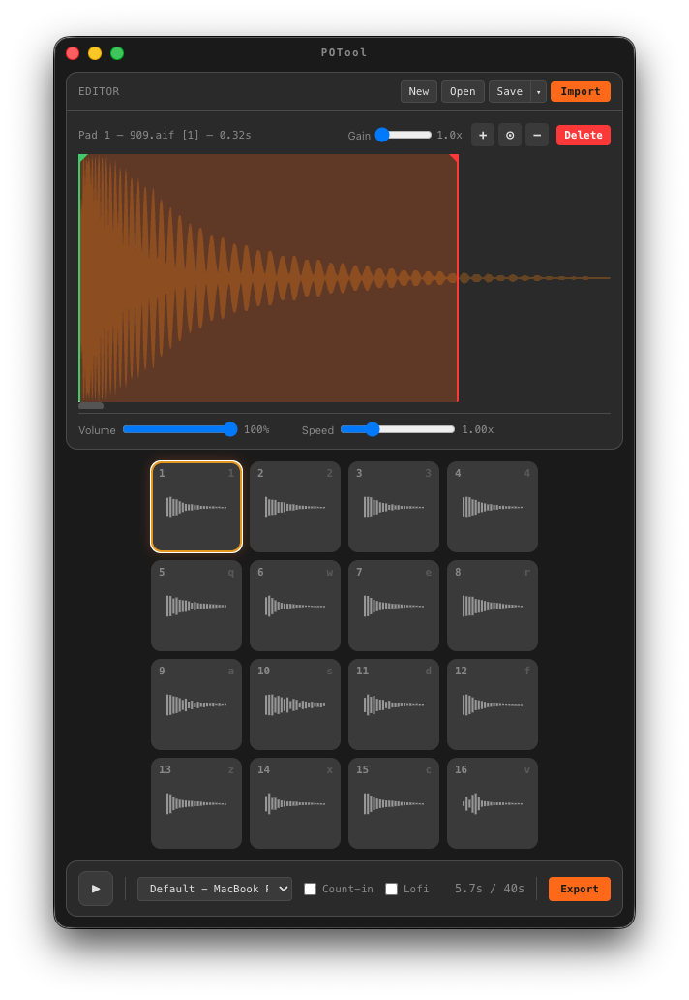

# POTool

A desktop sample-pack editor built for [Teenage Engineering Pocket Operator](https://teenage.engineering/products/po) hardware. Load up to 16 audio samples onto a virtual pad grid, trim each clip to exactly what you need, preview the full sequence, and export a single merged WAV — ready to load directly onto your Pocket Operator.



---

## Features

- **16-pad sampler** — assign any audio file to any of the 16 pads; drag pads to reorder or swap them
- **Waveform editor** — visualise each clip with [wavesurfer.js](https://wavesurfer.js.org/) and set precise in/out trim points
- **Auto-slice** — automatic transient detection to quickly chop up a longer sample across multiple pads
- **OP-1 / OP-Z slice import** — when you load an `.aif` drum kit downloaded from [op1.fun](https://op1.fun), POTool reads the embedded `APPL` metadata chunk and offers a one-click button to apply the original slice cut points directly as pad trim points — no manual editing required
- **Change pitch+speed of samples** — change the speed and pitch of samples to save space - or just change the sound
- **Lofi Audio Preview** — Downsample the sounds to simulate how it will sound on the PO-33. Or export the downsampled audio to make it even more crunchy when you load it onto the PO-33.
- **Sequence preview** — full-length playback view with a scrolling timeline cursor showing the combined sequence
- **Project save/load** — projects are saved as a folder containing `project.json` and the audio files; portable and easy to share
- **WAV export** — exports a single, correctly interleaved stereo WAV file at 44.1 kHz

---

## Keyboard Shortcuts

Pads map to keyboard rows matching the Pocket Operator's 4×4 button grid:

| Row | Keys            | Pads  |
| --- | --------------- | ----- |
| 1   | `1` `2` `3` `4` | 1–4   |
| 2   | `Q` `W` `E` `R` | 5–8   |
| 3   | `A` `S` `D` `F` | 9–12  |
| 4   | `Z` `X` `C` `V` | 13–16 |

---

## Getting Started

### Prerequisites

- [Node.js](https://nodejs.org/) 18+
- npm 9+

### Install

```bash
npm install
```

### Development

```bash
npm run dev
```

### Build

```bash
# macOS
npm run build:mac

# Windows
npm run build:win

# Linux
npm run build:linux
```

---

## Project Structure

```
src/
  main/        # Electron main process — window, menus, IPC handlers
  preload/     # Context bridge (window.api)
  renderer/    # React app
    audio/     # Web Audio engine, buffer utilities, WAV export, transient detection
    components/  # UI components (PadGrid, WaveformEditor, SequenceView, …)
    stores/    # Zustand state store
    types/     # Shared TypeScript types
```
